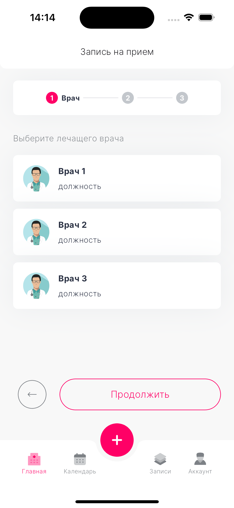
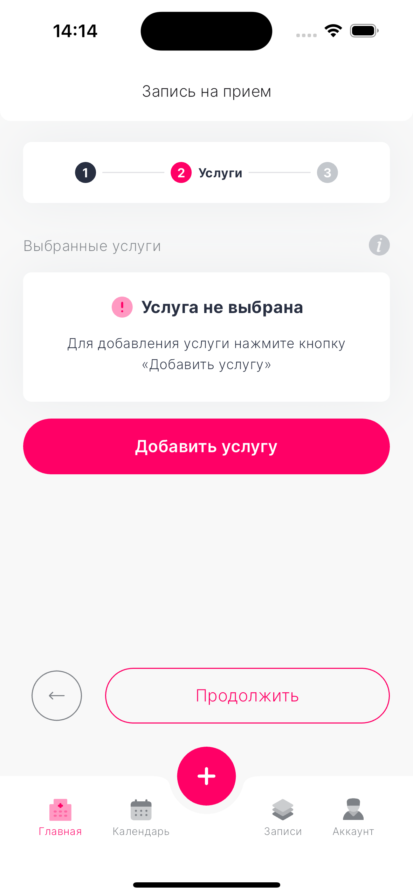
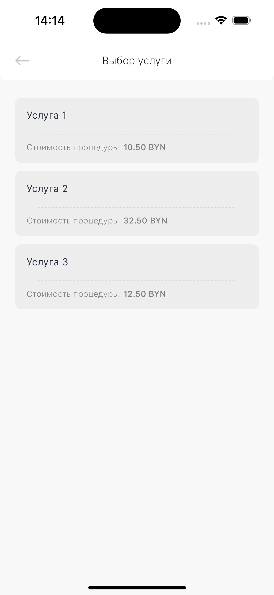
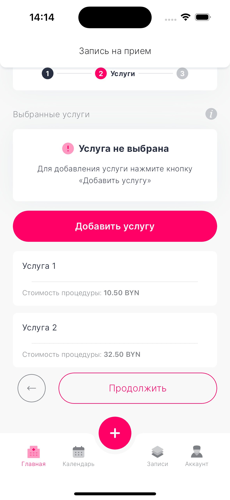
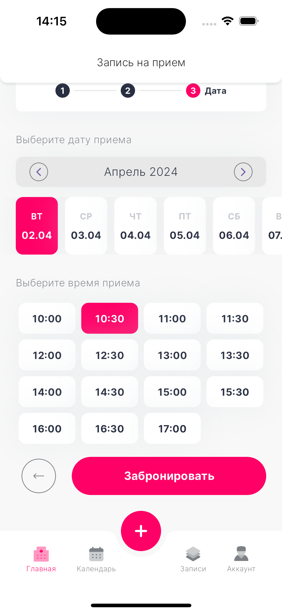
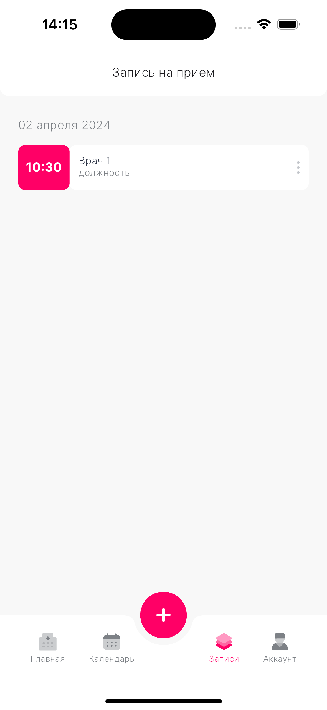
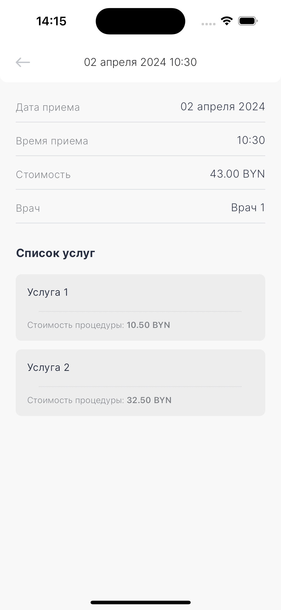

# Patient Appointment Booking System

## Overview

This Android application streamlines the process of booking appointments for patients with healthcare providers. It encompasses the entire booking flow, including selecting a provider, choosing services, and scheduling an appointment time. Additionally, it allows users to view all their booked appointments, enhancing user convenience and accessibility.

## Features

- **Doctor Selection**: Users can choose their healthcare provider from a list fetched through a REST API.
- **Service Selection**: Users can select one or more services after choosing a doctor.
- **Appointment Scheduling**: Users can pick a date and time for their appointment.
- **Local Database Storage**: Appointment records are stored locally, allowing for offline access.
- **Adaptive UI**: The app features an adaptive UI for a seamless experience across various devices.
- **State Management with BLoC**: Utilizes the BLoC pattern for effective state management.

## Technology Stack

- **Flutter & Dart**: For comprehensive mobile app development.
- **Flutter BLoC**: For managing app states.
- **REST API**: For data exchange with the server.
- **Local Database (SQLite or Hive)**: For storing data locally.

## Getting Started

### Prerequisites

- **Flutter**: Ensure Flutter is installed on your machine. [Flutter Installation Guide](https://flutter.dev/docs/get-started/install)
- **IDE**: Android Studio or Visual Studio Code, with Flutter and Dart plugins installed.

### Installation

1. Clone the repository
   ```bash
   git clone [your-repository-link]
   ```
2. Install Flutter packages
   ```bash
   flutter pub get
   ```
3. Run the application
   ```bash
   flutter run
   ```

## Screenshots

 
 
 
 
 
 
 


## Contact
 - **[Telegram](https://t.me/SimpleSanya)**
